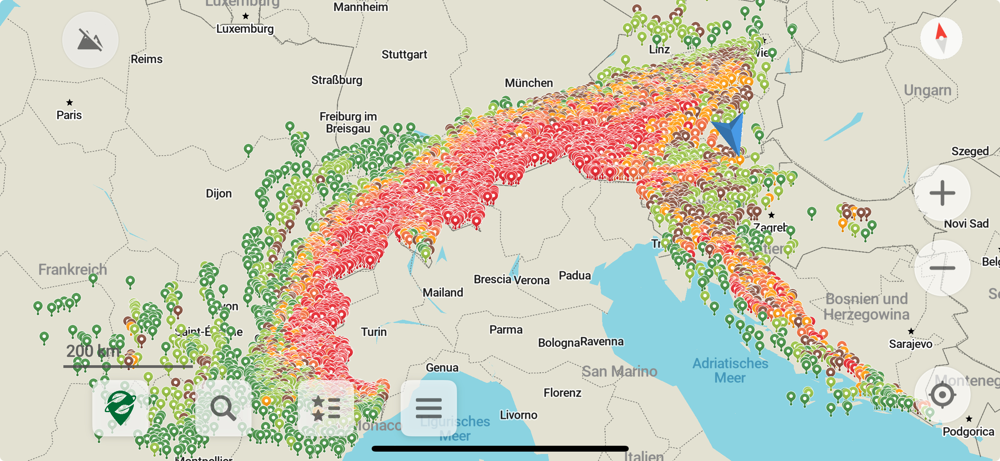
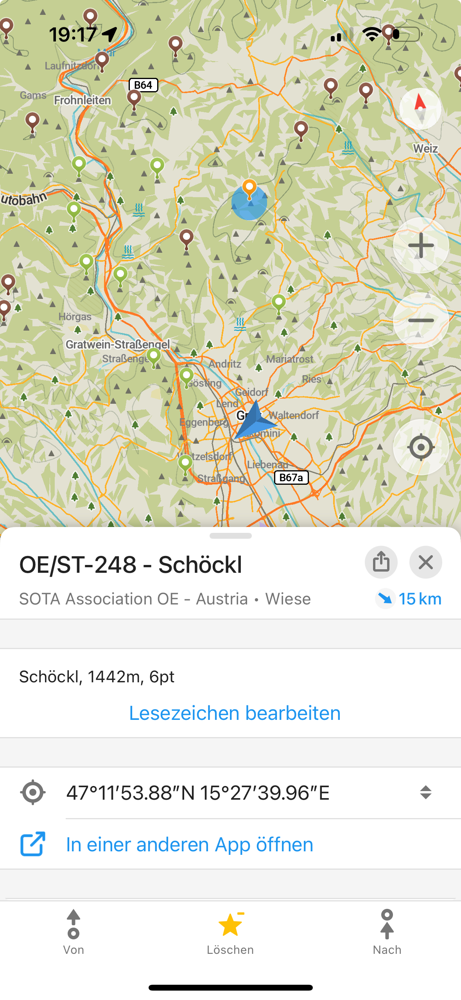

# SOTA Summits for OrganicMaps

Download kml files from [Sotl.as](https://sotl.as) for associations or regions and adds a color style, depending on the summit points. The kml file of sotl.as has no style information and therefore most mapping apps will show all points in the same color. This script will add color depending on the points of the summit.

The resulting kml file can then be imported as bookmarks into e.g. [OrganicMaps](https://organicmaps.app/).

The downloaded files are cached in the local file system.

## Usage

Download the data from sotl.as and add style information to it:

```bash
./sota_summits_to_kml.py OE/KT OE/ST DL HB
```

This will download the regions "OE/KT" and "OE/ST" and the associations "DL" and "HB" from sotl.as, add style information to each summit and write it to local files (`OE_ST_styled.kml`, `HB_styled.kml`, ...). These files can the be imported into various map applications.

## Import Data

An example how data imported (associations OE, HB, DL, F, 9A, S5) as bookmarks look like in OrganicMaps:



The details of one summit (OE/ST-248):



An example of region `OE/ST` can be found in the [examples](./examples) folder. This might help to see if you map application is able to read and display the output of this script.

## Thanks

Thanks to the developers of sotl.as for providing the data.

## Licence

This script is licensed by Apache License Version 2.0